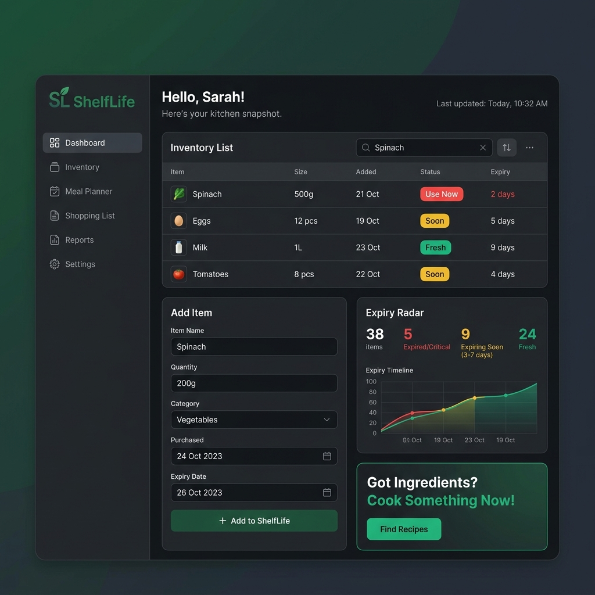
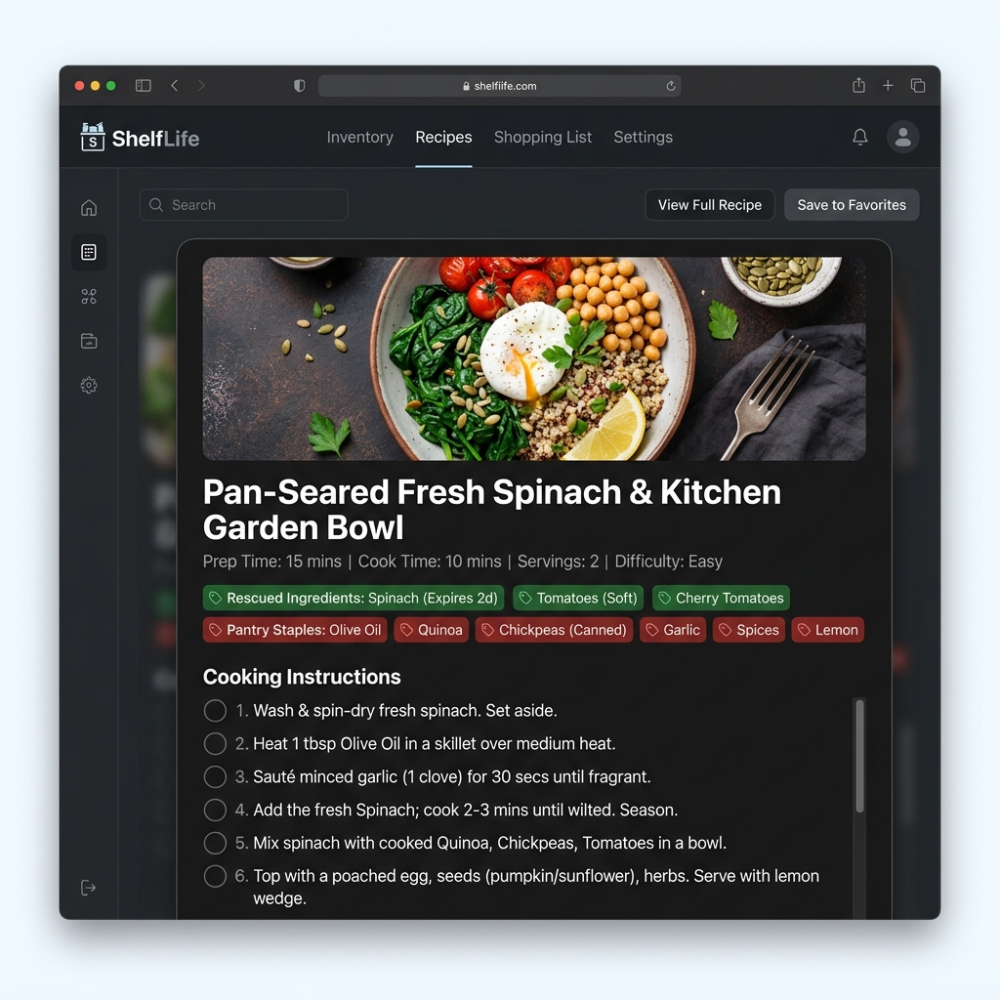
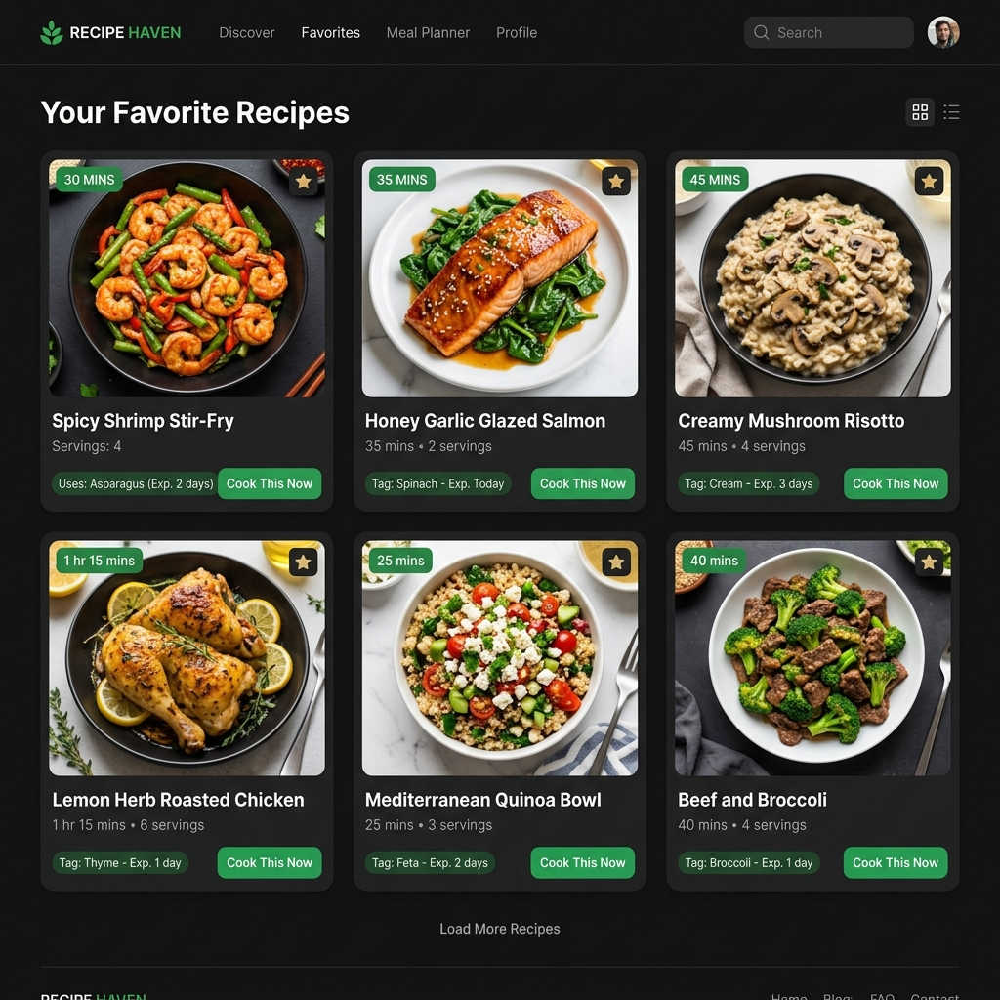

# 🥬 ShelfLife — Cook What You Have, Before It's Gone

> **A smart, zero-waste kitchen assistant powered by Google Gemini 2.5 Flash.**

[](https://shelflifeofficial.netlify.app)
[](https://ai.google.dev)

---

## 🌐 1. Live Deployed Application

- **Live Public URL**: [https://shelflifeofficial.netlify.app](https://shelflifeofficial.netlify.app)
*(Deployed & production-ready on Netlify)*

---

## 🎯 2. What ShelfLife Does & Problem Solved

### The Problem
Every year, the average household wastes hundreds of pounds of food simply because ingredients quietly spoil in the back of the fridge. Most people don't know what to cook with random leftover ingredients like half a bag of spinach, 2 eggs, and a pint of expiring milk.

### The Solution
**ShelfLife** is an intelligent, zero-waste kitchen companion created for home cooks, students, and busy families. It tracks kitchen inventory with real-time expiry countdowns and uses **Google Gemini 2.5 Flash** to generate delicious, tailored recipes around whatever ingredients are closest to going bad.

---

## 🌟 3. Complete Features List

- 📊 **Real-Time Expiry Radar**: Categorizes items into `Use Now` (0-1 days left), `Soon` (2-3 days), and `Fresh` (4+ days) with visual count statistics.
- 🥗 **Smart Kitchen Inventory Management**:
  - Full CRUD: Add, edit, remove, and mark items as used.
  - Category tagging (Produce, Dairy & Eggs, Protein, Bakery, Pantry) with auto-assigned emoji icons.
  - Instant Quick-Add chips for common perishable items.
  - One-click sample item reset for quick onboarding.
- ⚡ **Gemini 2.5 Flash AI Recipe Generator**:
  - Automatically prioritizes ingredients nearing expiry.
  - Supports dietary restriction filters: *Vegetarian, Vegan, Halal, Dairy-Free, Gluten-Free*.
  - Enforces structured JSON output via Gemini `responseMimeType: "application/json"`.
- 🍳 **Interactive Cooking Mode**:
  - Step-by-step checklist with completion checkmarks.
  - Dynamic servings scaler (`+` / `-` adjustment).
  - One-click "Copy Recipe to Clipboard".
  - Clear breakdown of rescued expiring items vs. standard pantry staples.
- 📖 **Saved Recipes Gallery**:
  - Save favorite AI-generated recipes to local browser storage.
  - Search and filter saved recipes anytime.
- ⚙️ **AI Settings & Credit Optimization**:
  - Choose between low-credit models (`Gemini 2.5 Flash`, `Gemini 2.0 Flash`, `Gemini 1.5 Flash`).
  - Configure custom Gemini API key directly in the UI.
- 🛡️ **Offline / Fallback Chef**: Built-in smart local fallback chef engine that generates recipes if offline or network is limited.

---

## 🤖 4. The AI Feature & System Prompt

### How the AI Works
The **Expiry Chef** feature takes your current kitchen shelf array (name, amount, days until expiry) along with your selected dietary restriction, and sends it to **Google Gemini 2.5 Flash** with strict system instructions to produce a single zero-waste recipe.

### System Instructions & Prompt Architecture

```text
You are Expiry Chef, a practical zero-waste home-cooking assistant inside the ShelfLife app.
Your single goal is to help the user cook a delicious meal using ingredients they already have, strictly prioritizing items closest to expiring.

Input:
- A JSON list of inventory items with name, amount, category, and days_left (days until expiry).
- Dietary restriction string (or 'none').

Rules:
1. Prioritize ingredients with the lowest days_left. Items with days_left <= 1 MUST be included if possible.
2. Assume standard pantry staples are available: salt, pepper, oil, water, sugar, basic dried spices.
3. Respect dietary restrictions strictly (vegetarian, vegan, halal, dairy-free, gluten-free).
4. Return exactly ONE recipe formatted strictly as valid JSON without markdown formatting or code blocks.
5. Expected JSON schema:
{
  "title": string,
  "description": string,
  "uses_expiring_items": string[],
  "missing_ingredients": string[],
  "servings": number,
  "prep_time_minutes": number,
  "difficulty": "Easy" | "Medium" | "Hard",
  "steps": string[]
}
6. Keep steps clear, numbered sequentially, concise, and actionable.
7. If inventory cannot support any dish, return title "Not enough ingredients" with empty lists and 0 values.
```

---

## 🛠️ 5. Tools, Services & AI Models

| Component | Technology |
| :--- | :--- |
| **Frontend Core** | React 18, Vite |
| **AI Model** | Google Gemini 2.5 Flash (`gemini-2.5-flash`) |
| **API Protocol** | Direct Gemini REST API (`https://generativelanguage.googleapis.com/v1beta`) |
| **Styling & Design** | Modern Vanilla CSS3, Google Fonts (Work Sans, Bebas Neue, IBM Plex Mono) |
| **State & Storage** | React Hooks, LocalStorage API |
| **Deployment** | Netlify (`shelflifeofficial.netlify.app`) |

---

## 📸 6. Screenshots of the App in Action

### 1. Kitchen Inventory & Expiry Radar Overview


### 2. Gemini AI Expiry Chef & Interactive Cooking Mode


### 3. Saved Favorites Gallery


---

## 🚀 7. How to Run the Project Locally

### Prerequisites
- Node.js (v18 or higher)
- npm or yarn

### Installation Steps

1. **Clone or navigate to the repository**:
   ```bash
   cd "D:\Shelflife"
   ```

2. **Install dependencies**:
   ```bash
   npm install
   ```

3. **Configure Environment Variables**:
   Copy `.env.example` to `.env` (or create `.env`):
   ```env
   VITE_GEMINI_API_KEY=YOUR_GEMINI_API_KEY_HERE
   VITE_GEMINI_MODEL=gemini-2.5-flash
   ```

4. **Start the local development server**:
   ```bash
   npm run dev
   ```
   Open `http://localhost:5173` in your browser.

5. **Build for Production**:
   ```bash
   npm run build
   npm run preview
   ```

---

## 📄 License & Attribution

Built with ❤️ for a zero-waste world using **React**, **Vite**, and **Google Gemini 2.5 Flash**.
